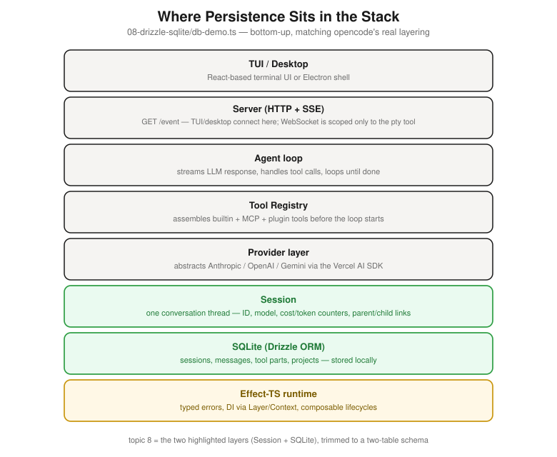

# opencode-harness

Agent harness engineering case study, using **opencode's actual stack**
(Bun, TypeScript, Effect, Drizzle, the Vercel AI SDK) rather than a Python
reimplementation -- companion to [`openrestaurant/`](../openrestaurant/) and
[`open-deep-research/`](../open-deep-research/) in this repo.

Every topic below is a real, runnable file, faithful to a specific piece of
opencode's real source (`/home/skanda/opencode` when this was built) --
each file's header comment says exactly what's ported verbatim, what's
simplified, and why. Where a real bug surfaced from actually running these
(several did -- a path-confusion bug, an unenforced permission check, a
missing file/directory branch in `grep`), the fix and the reasoning are also
in the comments, not just in this README.

## The spine (1 -> 4)

These four build on each other -- by the end of 4 you have one complete,
working mini-harness. Everything after extends this same loop.

| # | Topic | Run | What it shows |
|---|---|---|---|
| 1 | System prompt | `bun run 01` | persona + env + `AGENTS.md` + skills assembly, matched to opencode's real wording/order |
| 2 | Tools | `bun run 02 "<task>"` | real `read`/`grep`/`glob`/`edit`/`write`/`shell`, ripgrep-backed, real Claude tool-use call |
| 3 | Message history | `bun run 03` | why conversational state lives in `messages[]`, not the system prompt (which never changes across the 2 calls) |
| 4 | Agent harness | `bun run 04 "<task>"` | the explicit loop-until-`end_turn`, combining 1+2+3 for real |

## Extensions (5 -> 12)

Each of these picks up the topic-4 harness and extends one piece of it.

| # | Topic | Run | Extends |
|---|---|---|---|
| 5 | Permission system | `bun run 05` | a real ask/allow/deny ruleset (run directly in a terminal to get a live y/n prompt) |
| 6 | Compaction | `bun run 06` | summarizing history via a second real LLM call when it overflows |
| 7 | Sub-agents | `bun run 07` | the `task` tool -- a nested harness loop with its own fresh context |
| 8 | Drizzle + SQLite | `bun run 08` | real persistence (via Bun's built-in `bun:sqlite`, one of opencode's actual drivers) replacing the in-memory array |
| 9 | Effect-TS | `bun run 09` | the same permission check from topic 5, rewritten in opencode's real paradigm (typed errors, DI via `Layer`) -- standalone, nothing else imports it |
| 10 | WebSocket/TUI | `bun run 10:server` (terminal 1) + `bun run 10:client` (terminal 2) | streaming harness events live, no polling -- a plain terminal client, deliberately not a browser page (see Codespaces note below) |
| 11 | MCP client | `bun run 11` | consuming `openrestaurant/mcp_server/server.py`'s real MCP server from TypeScript -- cross-language, zero changes to that server |
| 12 | Observability | `bun run 12` | real Langfuse JS SDK tracing the harness loop, same account as `openrestaurant`'s Python instrumentation |

## Diagrams & mental models

Pulled from the curated context-engineering notes this case study is built
from (reverse-engineered against `anomalyco/opencode`'s real source, kept at
`/home/skanda/opencode` on the machine this was authored on) -- one per
topic above, as real image files under [`docs/`](docs/) rather than inline
Mermaid/ASCII, so they render the same everywhere (GitHub, a local Markdown
viewer, a slide deck) and stay next to the topic they illustrate. Where the
source notes have a diagram, it's redrawn here as an SVG in the same style
as [`openrestaurant/docs/`](../openrestaurant/docs/); where they don't,
that's called out rather than invented.

### 1. System prompt -- assembly diagram

![System prompt assembly: 5 static sources (persona .txt, environment block, AGENTS.md/CLAUDE.md, skills list, rare per-user override) fan into a system[] array; the user's message goes into a separate, growing messages[] array instead; both feed the LLM API call](docs/01-system-prompt.svg)

Mental model: the system prompt is static config assembled once before the
loop starts. The user's message never touches it -- it always lands in the
messages array instead. `01-system-prompt/system-prompt.ts` reproduces this
exact assembly order.

### 2. Tools -- anatomy + permission flow


Mental model: every tool is the same three-part shape (description, schema,
execute) and always runs permission check -> side effect -> output-back-to-
history, in that order. `02-tools/tools.ts` wires the same shape around
real `read`/`grep`/`glob`/`edit`/`write`/`shell`.

### 3. Message history -- full request flow


And what actually goes over the wire each call:


Mental model: the user's message is just the newest item appended to the
messages array. `03-message-history/message-history.ts`'s `HistoryMessage[]`
+ `toModelMessages()` is that array plus the wire-format conversion step.

### 4. Agent harness -- the reduce loop

![Reduce loop diagram: state0 is [systemPrompt, userMessage]; staten+1 = staten + LLM_response(staten) + tool_results(staten), repeating until stop_reason equals end_turn, then the final reply is returned](docs/04-agent-harness.svg)

Mental model: not a render loop (pure) but a reduce loop (impure) -- tool
calls have side effects (files change, shell runs), and those side effects
become part of the next state via tool-result messages. `04-agent-harness/harness.ts`'s
explicit `while` loop is this reduce, spelled out.

### 5. Permission system


```ts
yield* ctx.ask({
  permission: "read",
  patterns: ["/foo/bar.ts"],
  always: ["*"],       // patterns auto-allowed, skip the prompt entirely
})
```

Mental model: this check sits inside *every* tool's execute, not bolted on
afterward. `05-permission-system/permissions.ts` upgrades topics 2-4's
"always allow" stub into exactly this three-outcome ruleset.

### 6. Compaction

No dedicated diagram in the source notes -- the mental model is a one-line
exception to topic 4's loop: when history overflows, a *separate* LLM call
summarizes prior turns and the summary **replaces** the old messages (the
system prompt itself is never touched). `06-compaction/compaction.ts`
implements that swap, with a crude character-count proxy standing in for a
real token-count-vs-context-window check.

### 7. Sub-agents

No dedicated diagram -- the mental model is one line: **sub-agents are
nested context windows**, not a different mechanism. The `task` tool spawns
a child session with its own fresh system prompt + history -- `runHarness()`
called again from inside a tool's `execute`. `07-sub-agents/sub-agents.ts`
ports the foreground (blocking) mode; background mode is left as a comment,
not implemented, since it needs persistence + an event bus (topics 8 + 10).

### 8. Drizzle + SQLite -- where this sits in the stack



Mental model: a Session is the persisted unit of work (ID, model, cost/token
counters, parent/child links for sub-agents) with Messages broken into Parts
(text, tool call, tool result, attachment). `08-drizzle-sqlite/db-demo.ts`'s
two-table `sessions`/`messages` schema is a trimmed version of exactly this.

### 9. Effect-TS

No dedicated diagram -- the mental model is what Effect buys over
`async/await + try/catch`: typed errors (no surprise throws), dependency
injection via `Layer`/`Context.Service`, and composable, automatically
cleaned-up lifecycles. `09-effect-ts/effect-demo.ts` rewrites topic 5's
permission check in this paradigm, standalone.

### 10. WebSocket/TUI -- the full request flow


Mental model: every message part, tool call, and permission request streams
to the client as it happens -- the UI stays reactive without polling.
Correction, verified directly against the live source: real opencode's
general event stream (`GET /event`) is actually **Server-Sent Events**, not
WebSocket -- WebSocket there is scoped to exactly one feature, the embedded
terminal (`pty`), which genuinely needs full-duplex (keystrokes flowing up
while output streams down, simultaneously). `10-websocket-tui/server.ts` +
`client.ts` use real WebSocket (`ws`, a real opencode dependency) anyway,
for a job that in the real codebase is actually handled by SSE -- a
deliberate, disclosed deviation (see the file's own header comment), not a
fidelity claim.

### 11. MCP client

No dedicated diagram -- the mental model is one line from the tool-registry
layer: "MCP servers can add more tools dynamically." From the LLM's side an
MCP tool is indistinguishable from a builtin one -- same three-part shape
(description, schema, execute) wrapped around a network call instead of
local code. `11-mcp-client/mcp-client.ts` connects to
`openrestaurant/mcp_server/server.py`'s real MCP server to make that
concrete, cross-language.

### 12. Observability

Not covered in the curated opencode notes -- Langfuse isn't part of
opencode's own real stack (see `src/observability.ts`'s header comment for
the correction on that point, after an earlier draft of this claimed
otherwise and was checked against the live repo). It's included here as the
standard, real-world choice for LLM observability -- same reasoning as
`openrestaurant`'s Python side, not something ported from opencode itself.

## Setup

Dependencies install automatically via this repo's root `.devcontainer/`
(Bun + `bun install` + `ripgrep`, alongside the Python side for
`openrestaurant`/`open-deep-research`) -- see the top-level README. Add your
own `ANTHROPIC_API_KEY` (and `LANGFUSE_*` for topic 12) to the repo-root
`.env` -- shared with `openrestaurant`/`open-deep-research`, not a separate
file here. Each topic's `package.json` script passes
`--env-file=../.env` explicitly, since Bun's own `.env` auto-loading only
checks the current working directory, not parent directories.

Each numbered topic has its own `project/` sample directory it operates on
(sandboxed only in the sense that it's a small throwaway directory, not a
hard path restriction -- see `src/project-path.ts`'s header comment for why
there's no path jail here, matching how opencode itself actually scopes
tools). **Run this on a scratch branch or a fresh Codespace**, not on work
you care about -- topics 2, 4, 5, and 7 give a real model real `edit`/
`write`/`shell` access.

## `src/`, not per-topic silos

Real implementation code lives in `src/` (one file per opencode concept:
`system-prompt.ts`, `tools.ts`, `harness.ts`, `permission.ts`, `db.ts`, ...),
imported by each numbered topic's thin driver script -- same convention as
`open-deep-research`'s `notebooks/` importing from `src/deep_research_from_scratch/`.
This matters once topics depend on more than one earlier topic (topic 4 needs
1+2+3; topic 11 needs 2+4): every topic imports from the same place
regardless of which topic introduced what, and a topic like 5 can upgrade
`src/permission.ts`'s stub into something real without editing another
topic's folder.

## A note on fidelity

These are **faithful re-creations using opencode's real libraries and
patterns**, not literal copies of opencode's source files -- the real files
are wired into opencode's internal `@opencode-ai/core` package and a large
Effect `Layer`/`Context.Service` DI graph that isn't runnable standalone
outside that monorepo. Where something is simplified (e.g., `edit`'s fuzzy
fallback matching, `shell`'s destructive-command detection using a keyword
heuristic instead of a real tree-sitter AST parse), the file's header comment
says so explicitly and explains why.
