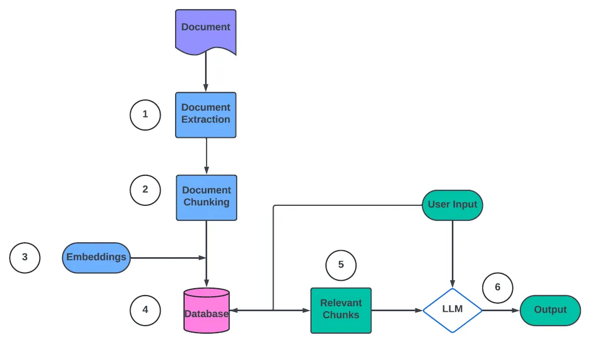
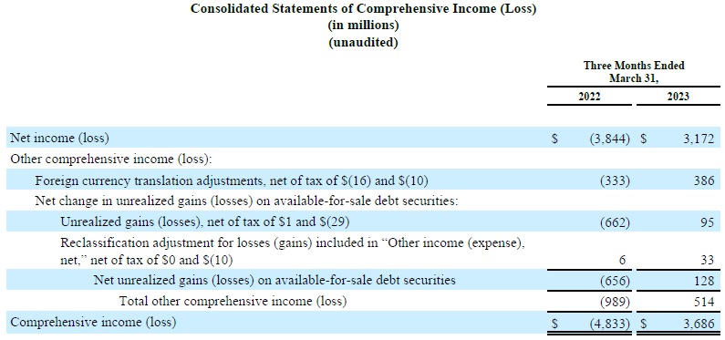
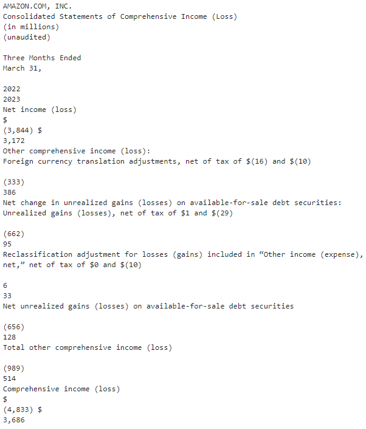
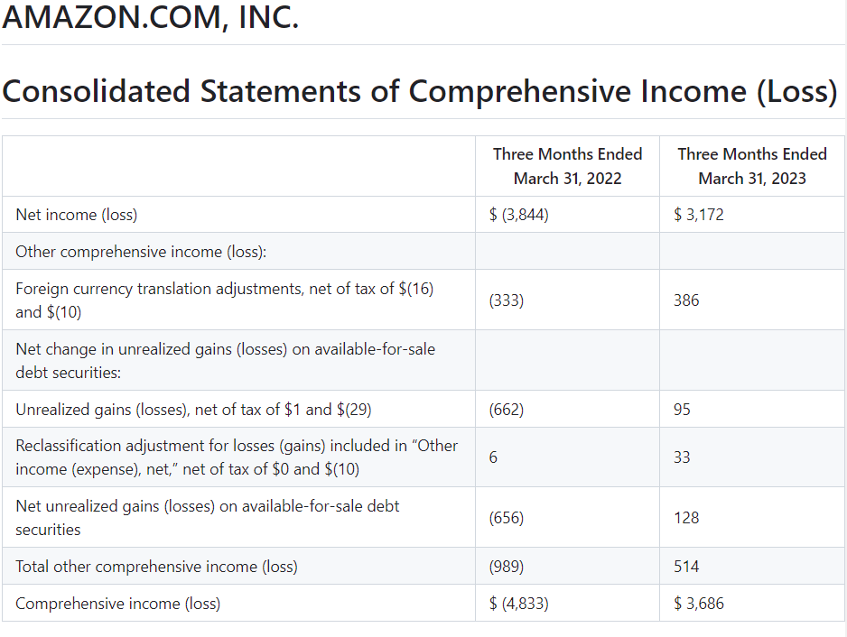
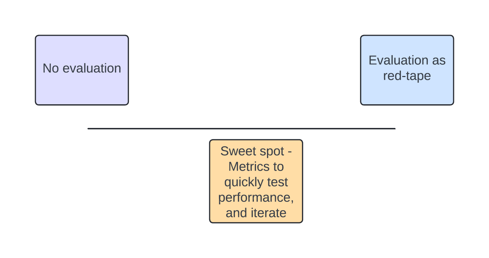

# RAG From Scratch: Chapter 3, Optimizing RAG

Ported from [skandavivek/RAG-From-Scratch Ch3](https://github.com/skandavivek/RAG-From-Scratch/tree/main/Ch3).
It compares four RAG pipelines on Amazon's Q1 2023 earnings release, then scores them two ways.

> [!IMPORTANT]
> **Using the Codespace? Everything is already installed. Don't run any install commands.**
> Open `ch3_optimizing_rag.ipynb`, pick the **`.venv`** kernel from the repo root, and run the cells.
> The only API key needed is `OPENAI_API_KEY` in the repo-root `.env`.

## The RAG flow



Each of the four approaches changes one step of this flow:

| # | Approach | Step it changes |
|---|---|---|
| 1 | **Basic RAG**: PyMuPDF plain-text extraction, sentence chunking, OpenAI embeddings | baseline |
| 2 | **Intelligent parsing**: layout-aware PDF → markdown, one chunk per page | ① extraction |
| 3 | **Re-ranking**: retrieve 5 chunks, the LLM re-ranks them and keeps the best 3 | ⑤ relevant chunks |
| 4 | **Hybrid search**: dense embeddings + BM25 keyword vectors | ③ embeddings / ④ database |

## Why document extraction matters

Financial documents are mostly tables. Here is page 9 of the earnings release:



Plain-text extraction (approach 1) flattens it, so the numbers lose their row and column:



Parsing to markdown (approach 2) keeps the table structure, so the LLM can tell which
number belongs to which line item and year:



This figure is from the original chapter, which used LlamaParse. Here the parsing is done
locally by [`pymupdf4llm`](https://pymupdf.readthedocs.io/en/latest/pymupdf4llm/), with no
API key. Its markdown for this page is similar: the same rows and the 2022/2023 columns.

## Evaluation



Aim for the middle: enough metrics to compare changes quickly, not so much process that it slows iteration.

The notebook evaluates the four approaches two ways:

- **Ground truth:** 57 question/answer pairs (`data/gt-aws-q1-2023.json`). An LLM judge
  (`gpt-4.1`) scores each generated answer as correct (1) or wrong (0) against the reference.
- **Reference-free ([DeepEval](https://github.com/confident-ai/deepeval)):** faithfulness,
  context relevancy and answer relevancy. These need only the question, the answer and the
  retrieved context, so they work where no ground truth exists. They run on the first 6
  questions to keep it quick.

The full ground-truth loop makes about 500 OpenAI calls and takes 10–15 minutes.

## API keys: only `OPENAI_API_KEY`

It's the same key the `open-deep-research` notebooks use, read from the shared `.env` at
the repo root. If it's missing, the first cell prompts for it.

The original chapter needed three more services. They're replaced with local equivalents:

| Original | Key it needed | Here |
|---|---|---|
| LlamaParse | `LLAMA_CLOUD_API_KEY` | `pymupdf4llm`: local PDF → markdown, tables included |
| Qdrant Cloud | `QDRANT_URL`, `QDRANT_API_KEY` | Qdrant in-memory (`QdrantClient(location=":memory:")`); same API |
| Hybrid search sparse vectors | none | FastEmbed `Qdrant/bm25`, runs locally (small one-time model download) |
| DeepEval | none (Confident AI login is optional) | unchanged; calls OpenAI directly |

Models: `gpt-4.1-mini` answers questions and re-ranks, `gpt-4.1` is the judge, and
`text-embedding-3-small` does the embeddings. They replace the original
`gpt-3.5-turbo` / `gpt-4` / `gpt-4o`.

## Files

```
rag-from-scratch/
├── ch3_optimizing_rag.ipynb              # the walkthrough
├── slides-optimizing-rag.pdf             # chapter slides
├── images/                               # figures used in this README
└── data/
    ├── Q1-2023-Amazon-Earnings-Release.pdf
    └── gt-aws-q1-2023.json               # 57 ground-truth question/answer pairs
```

## Local setup (only if you are NOT using the Codespace)

From the repo root: `uv sync`, put `OPENAI_API_KEY=...` in `.env`, then open the notebook
with the `.venv` kernel.
